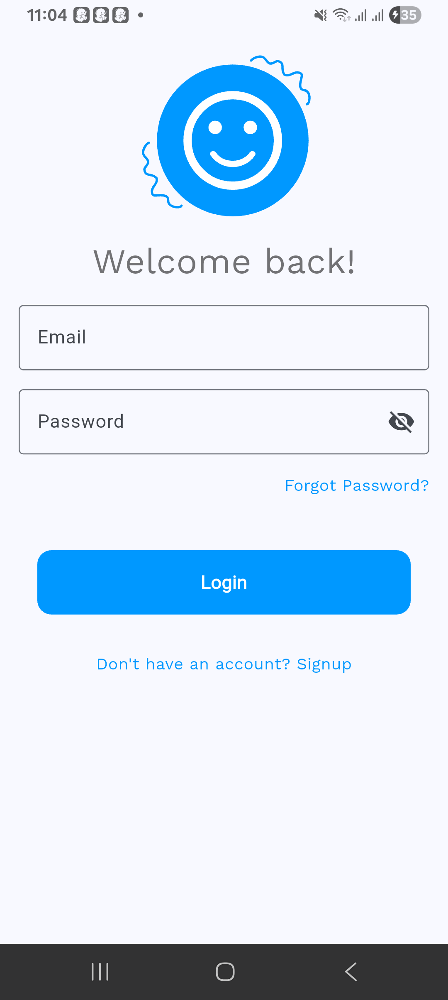
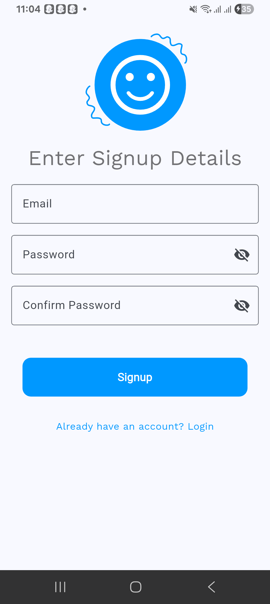
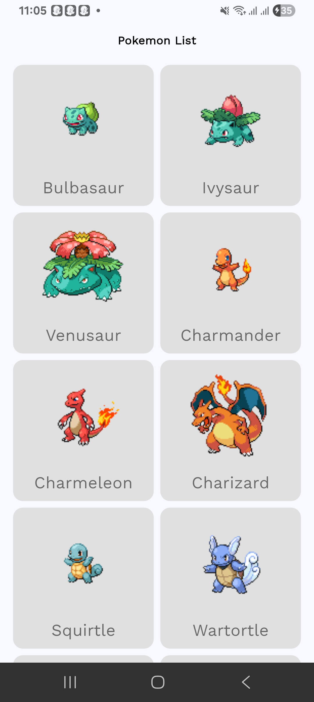
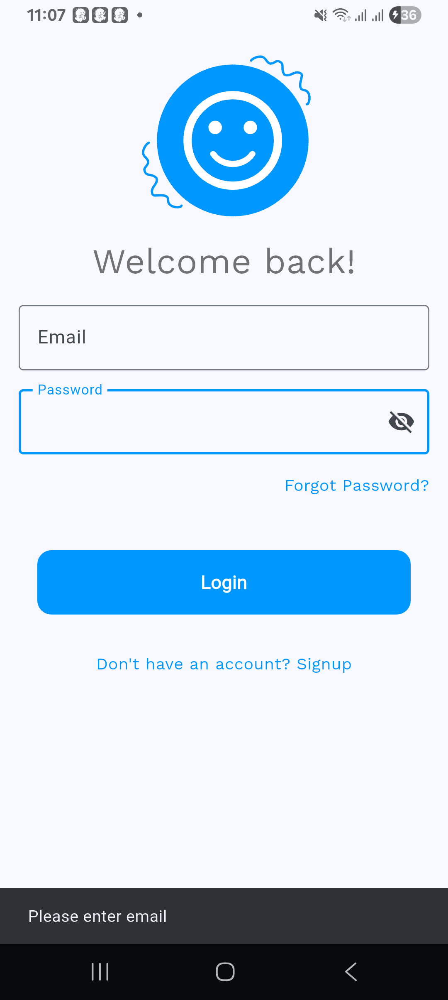

# BMI Calculator

A new Flutter project.

## Getting Started

This project is part of **Assignment 7** from the TuteDude Flutter course.  
**Create “Poképedia” – A Fun & Creative Pokédex App**

## Description

This app is a Creative Pokédex App

- The app first show login screen where user can enter his email and password to login
- On tap don't have an account he will be redirected to signup page
- once login or signup he can se home page where he can see list of pokemons fetched from apis

## Screenshots

