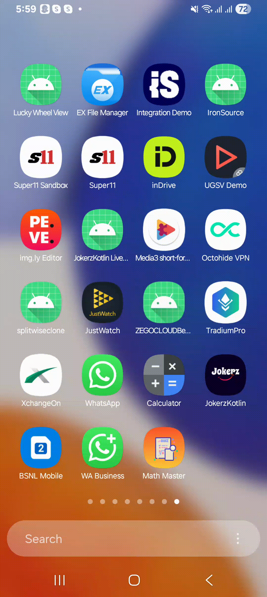

# BMI Calculator

A new Flutter project.

## Getting Started

This project is part of **Final Assignment** from the TuteDude Flutter course.  
**Created Math Master Quiz App**

## Description

This app is a Creative Pokédex App

- The app first show Welcome screen with logo and name
- When user click get started math quiz get starts. It show randomly generated question and randomly generated option . When user select
option it shows if it is correct and wrong by green and red color. it also plays a sound based on correct or wrong
- When user press finish it show score screen

## video
  Please check below video

